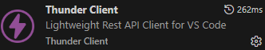
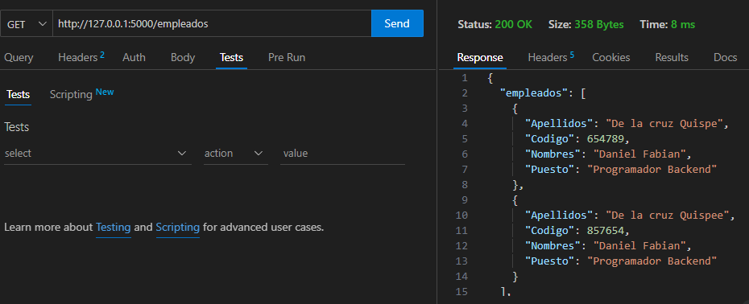
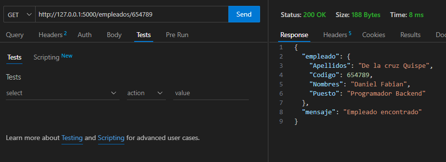
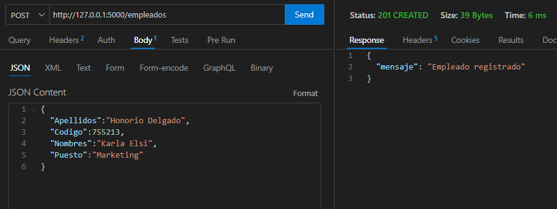
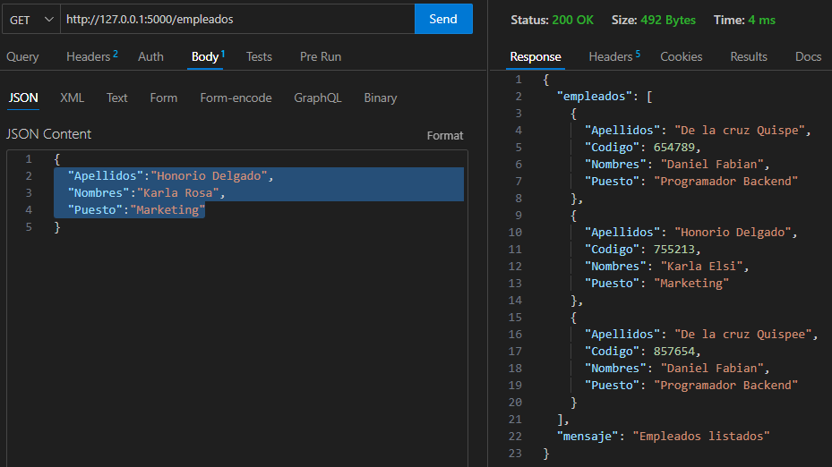
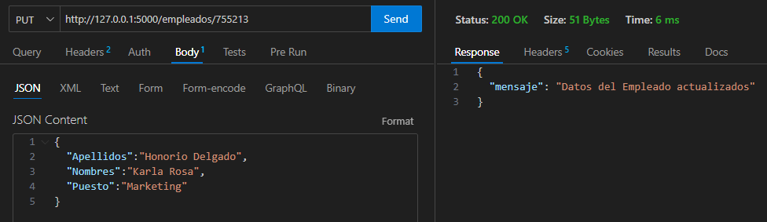
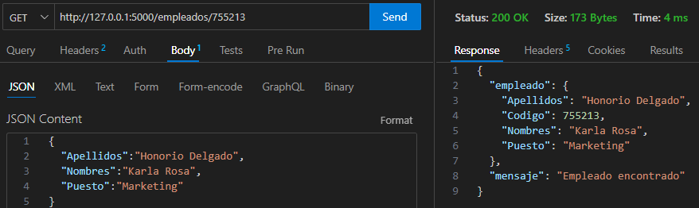
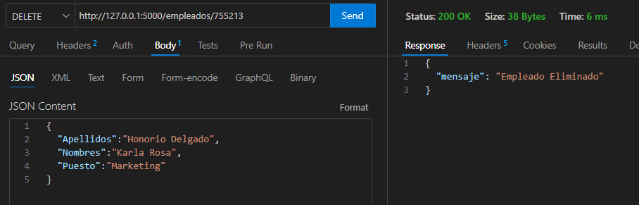
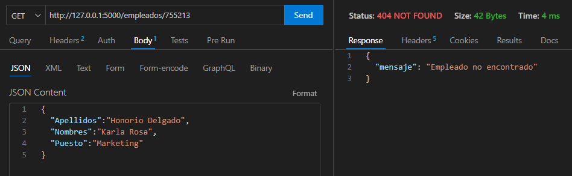

# Lista de empleados
## Descripcion
Este programa solo funciona como un backend que genera API rest de una base de datos en forma de json
## Instalacion
Para el uso de este servidor recomiendo el uso de un entorno virtula usando "virtualenv".
Usaremos pip para instalarlo en la terminal de visualcode
```bash
pip install virtualenv
```
Luego usaremos virtualenv para crear el entorno virtual usando como lenguaje python3
```bash
virtualenv -p python3 env
```
Esto creara una carpeta en la que se aloja todos los paquetes, para usar la consola del entorno virtual usaremos el siguiente comando
```bash
.\env\Scripts\activate     
```
Luego de esto antes de la linea de comando aparecera (env) esto significara que ya estamos trabajando con la consola del entorno virtual, en ella empezaremos a instalar las dependencias necesarias, para lo cual usaremos pip
```bash
pip install setuptools wheels flask flask_mysqldb
```
luego usaremos "pip list" para revisar la instalacion y deberia quedar como esta lista
# 
tras esto la instalacion ya deberia estar completa tan solo faltaria que crees la base de datos o en todo caso exportar la adjunta en este archivo, para modificar el host, user, contraseña y el nombre de la base de datos deberas ir a src/config.py dentro de este archivo esta la configuracion basica del servidor y los datos para la base de datos

## Uso
Para que el programa empieze a funcionar deberan utilizar un programa como XAMPP que te permite usar tu computadora como servidor localhost y despues en la terminal de visualstudio usar el siguiente comando para inicializar el programa
```bash
python .\src\app.py
```
Para probarlo yo use thunder client el cual me permite enviar un comando http especifico al momento de entrar en la URL 
# 

# 
En esta imagen usamos el comando GET en la URL de los empleados para obtener el API con la lista de empleados
#  
En esta imagen usamos el comando GET en la URL de los empleados/654789 en donde 654789 es el codigo personal de uno de los empleados y funciona de la misma manera para todos los empleados
#  
En esta imagen usamos el comando POST en la URL de los empleados para subir la informacion de una nueva empleada
#  
En esta imagen usamos el comando PUT en la URL del empleado para modificar la informacion
#  
En esta imagen usamos el comando DELETE en la URL del empleado para eliminar su informacion